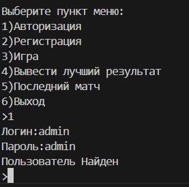

This is my Game Wordle on C#

Метод генерации числа
static string generateNumber()
        {
            string num ="";
            string number = "";
            Random rnd = new Random();
            while(number.Length < 4){
                num = Convert.ToString(rnd.Next(0,10));
                if(!number.Contains(num)){
                    number += num;
                }
            }
            
            
            return number;
        }
Сама менюха 
